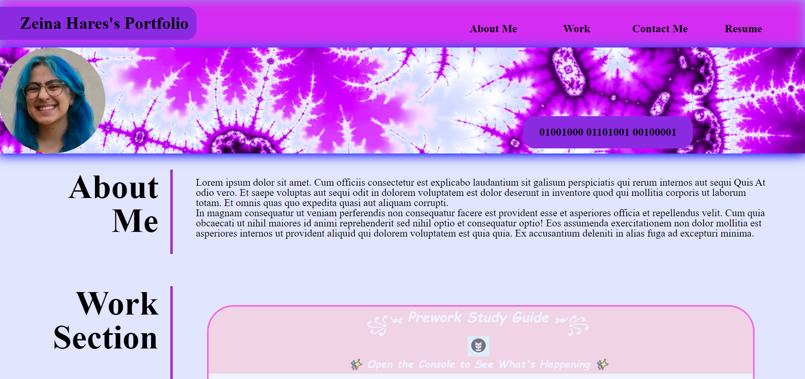

# Zeina Portfolio

## Description

I built this website as a portfolio to keep track of my coding assignments and have them viewable to potential employers and anyone insterested in
my work.

This project helped me learn a lot about CSS and HTML layout. I learned that CSS is very fidley and you can keep working on it forever.

## Installation

N/A

## Usage

You can scroll and find a description about me, links attached to an image (or abstract of the work), title and description of which language was used for the program. If you hover over the image it has a glow and an overlay is removed. If you click on the navigation bar it also takes you to it's corresponding section. If you click on the items in contact me they take you to their relative links. When the screen is minimised to phone size, the layout changes, and the nav and contact me items have a shadow when clicked on.

  

## License

MIT License

Copyright (c) 2023 zeinahares

Permission is hereby granted, free of charge, to any person obtaining a copy
of this software and associated documentation files (the "Software"), to deal
in the Software without restriction, including without limitation the rights
to use, copy, modify, merge, publish, distribute, sublicense, and/or sell
copies of the Software, and to permit persons to whom the Software is
furnished to do so, subject to the following conditions:

The above copyright notice and this permission notice shall be included in all
copies or substantial portions of the Software.

THE SOFTWARE IS PROVIDED "AS IS", WITHOUT WARRANTY OF ANY KIND, EXPRESS OR
IMPLIED, INCLUDING BUT NOT LIMITED TO THE WARRANTIES OF MERCHANTABILITY,
FITNESS FOR A PARTICULAR PURPOSE AND NONINFRINGEMENT. IN NO EVENT SHALL THE
AUTHORS OR COPYRIGHT HOLDERS BE LIABLE FOR ANY CLAIM, DAMAGES OR OTHER
LIABILITY, WHETHER IN AN ACTION OF CONTRACT, TORT OR OTHERWISE, ARISING FROM,
OUT OF OR IN CONNECTION WITH THE SOFTWARE OR THE USE OR OTHER DEALINGS IN THE
SOFTWARE.
